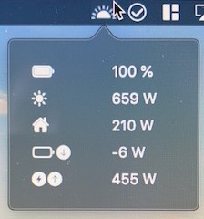

# senecStatus
Dies ist eine macOS Menübar App welche die aktuellen Verbrauchswerte des Senec Speichers anzeigt

Aktuell gibt es keine Optionen und ausschließlich hardgecodet, dass der Speicher unter senecspeicher.fritz.box erreichbar sein muss.
Anpassungen folgen!
